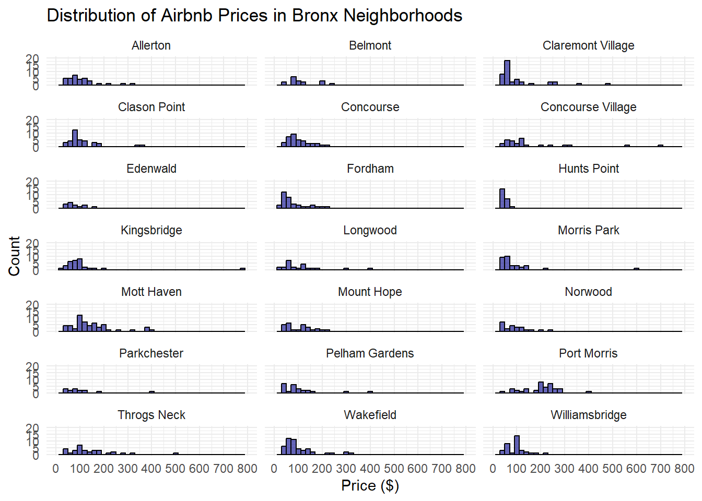
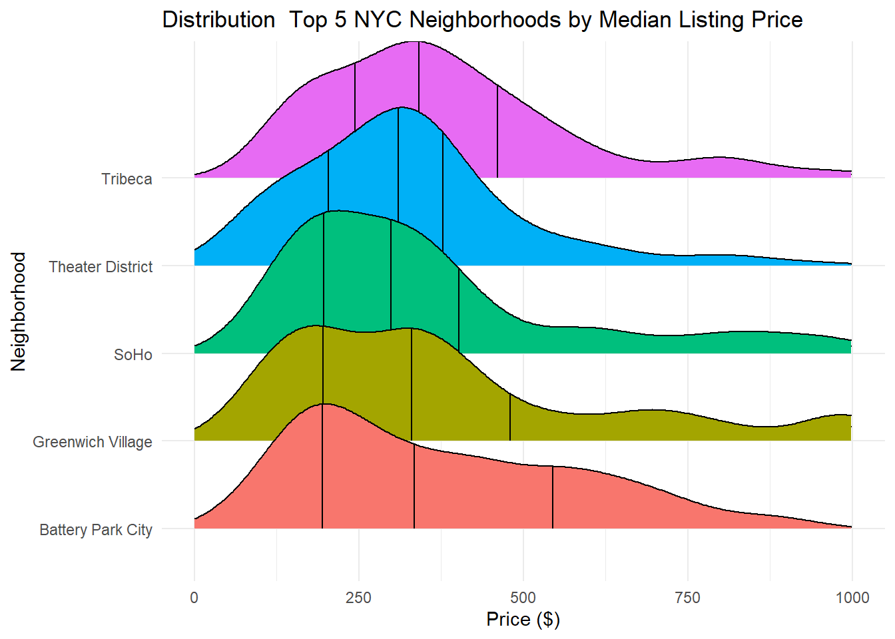
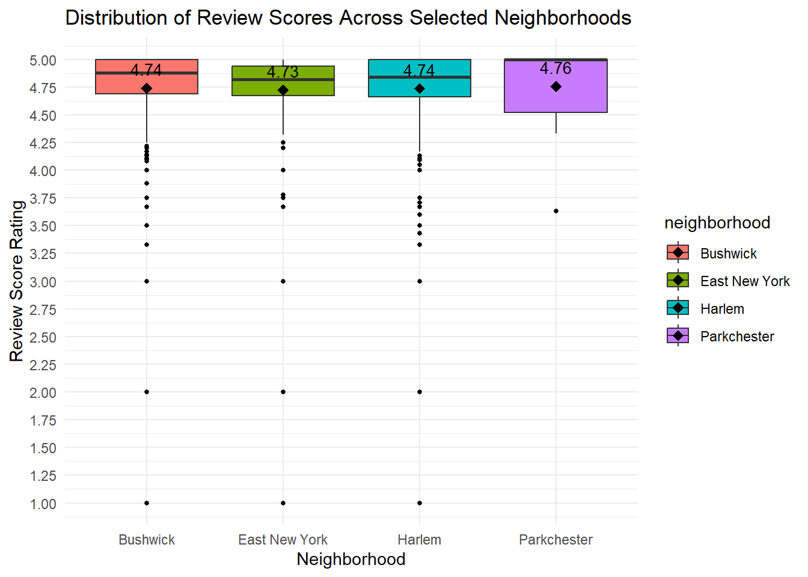

load packages

``` r
library(tidyverse)
```

```
## Warning: package 'tidyverse' was built under R version 4.4.1
```

```
## Warning: package 'ggplot2' was built under R version 4.4.1
```

```
## ── Attaching core tidyverse packages ──────────────────────── tidyverse 2.0.0 ──
## ✔ dplyr     1.1.4     ✔ readr     2.1.5
## ✔ forcats   1.0.0     ✔ stringr   1.5.1
## ✔ ggplot2   3.5.1     ✔ tibble    3.2.1
## ✔ lubridate 1.9.3     ✔ tidyr     1.3.1
## ✔ purrr     1.0.2     
## ── Conflicts ────────────────────────────────────────── tidyverse_conflicts() ──
## ✖ dplyr::filter() masks stats::filter()
## ✖ dplyr::lag()    masks stats::lag()
## ℹ Use the conflicted package (<http://conflicted.r-lib.org/>) to force all conflicts to become errors
```

``` r
library(ggridges)
```

```
## Warning: package 'ggridges' was built under R version 4.4.1
```

read the data into R

``` r
nycbnb = read_csv("nycbnb.csv")
```

```
## Rows: 37765 Columns: 11
## ── Column specification ────────────────────────────────────────────────────────
## Delimiter: ","
## chr (3): neighborhood, borough, listing_url
## dbl (8): id, price, accommodates, bathrooms, bedrooms, beds, review_scores_r...
## 
## ℹ Use `spec()` to retrieve the full column specification for this data.
## ℹ Specify the column types or set `show_col_types = FALSE` to quiet this message.
```
 Problem 1. How many observations (rows) does the dataset have? Instead of hard coding the number in your answer, use inline code.

``` r
length(rownames(nycbnb))
```

```
## [1] 37765
```

``` r
nrow(nycbnb)
```

```
## [1] 37765
```
Problem 2. Run View(nycbnb) in your Console to view the data in the data viewer. What does each row in the dataset represent?

Each row represents a listing on Airbnb, there are specifics about each listing and each listing is unique.


Problem 3. Pick one of the five boroughs of NYC (Manhattan, Queens, Brooklyn, the Bronx, or Staten Island), and create a faceted histogram where each facet represents a neighborhood in your chosen borough and displays the distribution of Airbnb prices in that neighborhood. Think critically about whether it makes more sense to stack the facets on top of each other in a column, lay them out in a row, or wrap them around. Along with your visualization, include your reasoning for the layout you chose for your facets.
Filter a borough

``` r
bronx_data <- nycbnb[nycbnb$borough == "Bronx", ]
```
group neighborhood counts and filter for N >= 25

``` r
neighborhood_counts <- bronx_data |>
  group_by(neighborhood) |>
  summarise(listing_count = n())
# Filter neighborhoods with 10 or more listings
filtered_bronx_data <- bronx_data |>
  filter(neighborhood %in% neighborhood_counts$neighborhood[neighborhood_counts$listing_count >= 25])
```

plot


``` r
ggplot(filtered_bronx_data, aes(x = price)) +
  geom_histogram(binwidth = 20, fill = "darkblue", color = "black", alpha = 0.6) +
 #geom_text(stat = "bin", aes(label = ifelse(..count.. > 0, ..count.., "")), 
          #  vjust = -0.5, size = 2) +
  facet_wrap(~ neighborhood, ncol = 3) +
  labs(title = "Distribution of Airbnb Prices in Bronx Neighborhoods",
       x = "Price ($)",
       y = "Count") +
  scale_y_continuous(limits = c(0, 20), breaks = seq(0, 20, by = 5) ) +
  scale_x_continuous(limits = c(0, 800), breaks = seq(0, 800, by = 100),
   labels = function(x) ifelse(x %% 100 == 0, as.character(x), "")                  ) +
  
  theme_minimal()
```

```
## Warning: Removed 261 rows containing non-finite outside the scale range
## (`stat_bin()`).
```

```
## Warning: Removed 42 rows containing missing values or values outside the scale range
## (`geom_bar()`).
```

<!-- -->

``` r
  theme(plot.title = element_text(hjust = 0.5))
```

```
## List of 1
##  $ plot.title:List of 11
##   ..$ family       : NULL
##   ..$ face         : NULL
##   ..$ colour       : NULL
##   ..$ size         : NULL
##   ..$ hjust        : num 0.5
##   ..$ vjust        : NULL
##   ..$ angle        : NULL
##   ..$ lineheight   : NULL
##   ..$ margin       : NULL
##   ..$ debug        : NULL
##   ..$ inherit.blank: logi FALSE
##   ..- attr(*, "class")= chr [1:2] "element_text" "element"
##  - attr(*, "class")= chr [1:2] "theme" "gg"
##  - attr(*, "complete")= logi FALSE
##  - attr(*, "validate")= logi TRUE
```
I Decided to go with a Wrap because of the number of plots. After filtering neighborhoods with 25 + listings I ended up with 21 Neighborhoods  allowing me to present a 3X7 faceted plot.

Problem 4. Use a single pipeline to identity the neighborhoods city-wide with the top five median listing prices that have a minimum of 50 listings. Then, in another pipeline filter the data for these five neighborhoods and make ridge plots of the distributions of listing prices in these five neighborhoods. In a third pipeline calculate the minimum, mean, median, standard deviation, IQR, and maximum listing price in each of these neighborhoods. Use the visualization and the summary statistics to describe the distribution of listing prices in the neighborhoods. (Your answer will include three pipelines, one of which ends in a visualization, and a narrative.)

``` r
library(ggridges)
```

``` r
#4.1

top5_neighborhood <- nycbnb|>
  group_by(neighborhood) |>
  summarise(median_price = median(price, na.rm = TRUE),
            listing_count=n()) |>
  filter(listing_count >= 50)|>
  arrange(desc(median_price))|>
  slice_head(n=5)
print(top5_neighborhood)
```

```
## # A tibble: 5 × 3
##   neighborhood      median_price listing_count
##   <chr>                    <dbl>         <int>
## 1 Tribeca                    341           200
## 2 Battery Park City          334            82
## 3 Greenwich Village          330           205
## 4 Theater District           310           422
## 5 SoHo                       299           254
```


``` r
nycbnb |>
  filter(neighborhood %in% top5_neighborhood$neighborhood) |>
  ggplot(aes(x = price, y = neighborhood, fill = neighborhood)) +
  geom_density_ridges(scale = 1, alpha = 0.5) +
  stat_density_ridges(quantile_lines = TRUE)+
  labs(title = "Distribution  Top 5 NYC Neighborhoods by Median Listing Price",
       x = "Price ($)",
       y = "Neighborhood") +
  scale_x_continuous(limits = c(0, 1000)) +
  theme_minimal() +
  theme(legend.position = "none")
```

```
## Picking joint bandwidth of 63.9
```

```
## Warning: Removed 533 rows containing non-finite outside the scale range
## (`stat_density_ridges()`).
```

```
## Picking joint bandwidth of 63.9
```

```
## Warning: Removed 533 rows containing non-finite outside the scale range
## (`stat_density_ridges()`).
```

<!-- -->
Summary Stats

``` r
sel_neighborhoods <- selected_neighborhoods <- c("Tribeca", "Battery Park City", "Greenwich Village", "Theater District", "SoHo")
## ^^I could have done this in the first pipeline and would have been a smoother and more efficient approach
## I would like to keep a she summary in its own tibble which will be kept in memory
sum_stats <- nycbnb %>%
  filter(!is.na(price) & neighborhood %in% sel_neighborhoods) %>%# i was trying to this with top5_neighborhoods and kept running into a na error for the summary statistics which I then realized was because top_5 did not have a price column 
  group_by(neighborhood) %>%
  summarise(min_price = min(price, na.rm = TRUE),
            mean_price = mean(price, na.rm = TRUE),
            median_price = median(price, na.rm = TRUE),
            sd_price = sd(price, na.rm = TRUE),
            iqr_price = IQR(price, na.rm = TRUE),
            max_price = max(price, na.rm = TRUE))

print(sum_stats)
```

```
## # A tibble: 5 × 7
##   neighborhood    min_price mean_price median_price sd_price iqr_price max_price
##   <chr>               <dbl>      <dbl>        <dbl>    <dbl>     <dbl>     <dbl>
## 1 Battery Park C…        80       375.          334     211.      351        886
## 2 Greenwich Vill…        73       385.          330     251.      285        999
## 3 SoHo                   89       356.          299     223.      205        995
## 4 Theater Distri…        57       321.          310     165.      175.       946
## 5 Tribeca               150       378.          341     188.      217        999
```
Among the selected neighborhoods, the Theater District stands out as the most affordable, with the lowest mean price of $320.88 and the lowest minimum listing price of $57. It also has the lowest standard deviation of $165.46, indicating less variability in prices. Both Greenwich Village and Tribeca have the highest maximum listing price of $999. However, Greenwich Village has the highest standard deviation at $251.28, reflecting the greatest variability in pricing among the neighborhoods.

Problem 5. Create a visualization that will help you compare the distribution of review scores (review_scores_rating) across neighborhoods. You get to decide what type of visualization to create and which neighborhoods are most interesting to you, and there is more than one correct answer! In your answer, include a brief interpretation of how Airbnb guests rate properties in general and how the neighborhoods compare to each other in terms of their ratings. 

``` r
my_neighborhoods <- c("Parkchester","East New York","Bushwick","Harlem")
my_neighborhoods_data <- nycbnb|>
  filter(neighborhood %in% my_neighborhoods)
summary_stats<- my_neighborhoods_data|>
  group_by(neighborhood)|>
  summarise(mean_rating= mean(review_scores_rating, na.rm=TRUE),count=n())


ggplot(my_neighborhoods_data, aes(x = neighborhood, y = review_scores_rating, fill = neighborhood)) +
  geom_boxplot(outlier.colour = "black", outlier.shape = 16, outlier.size = 1) +
  geom_point(data = summary_stats, aes(x = neighborhood, y = mean_rating), color = "black", size = 3, shape = 18) +
  geom_text(data = summary_stats, aes(x = neighborhood, y = mean_rating, label = sprintf("%.2f", mean_rating)), 
            vjust = -1, color = "black", size = 3.5) +
  labs(title = "Distribution of Review Scores Across Selected Neighborhoods",
       x = "Neighborhood",
       y = "Review Score Rating") +
  scale_y_continuous(breaks = seq(0, 5.0, by = 0.25))+
  theme_minimal() 
```

```
## Warning: Removed 1028 rows containing non-finite outside the scale range
## (`stat_boxplot()`).
```

<!-- -->

``` r
 print(summary_stats)
```

```
## # A tibble: 4 × 3
##   neighborhood  mean_rating count
##   <chr>               <dbl> <int>
## 1 Bushwick             4.74  1550
## 2 East New York        4.73   294
## 3 Harlem               4.74  1757
## 4 Parkchester          4.76    25
```
Airbnb guests typically rate their stays based on a combination of factors such as convenience, amenities, price, cleanliness, safety, and accuracy relative to the listing description. From my experience, I evaluate my stay by considering my overall satisfaction at the end of the trip, comparing these factors to my expectations at the time of booking.

Based on the analysis above, I would expect Parkchester listings to provide an experience closer to the expectations set during booking. This expectation is supported by the fact that Parkchester listings show fewer outliers in their review scores. However, it’s important to note that the low number of Parkchester listings might contribute to this observation, potentially skewing the results.
